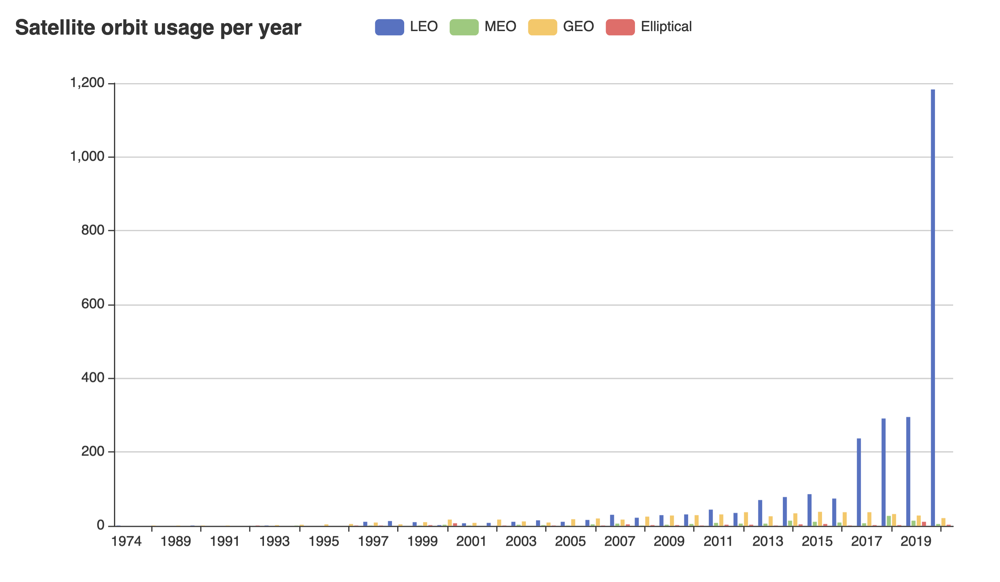
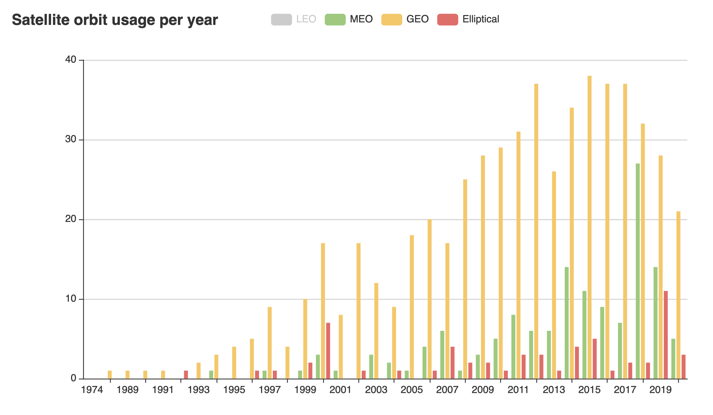

# Masterthesis

Code for generating an accompanying chart for my Masterthesis:

***"Hacker-Attacks Against Satellites - An Evaluation of Space Law in Regard to the Nature of Hacker-Attacks"***

> Master thesis in International Technology Law, Vrije Universiteit Amsterdam 

The thesis is available at [researchgate](https://www.researchgate.net/publication/353846410_Hacker-Attacks_Against_Satellites_An_Evaluation_of_Space_Law_in_Regard_to_the_Nature_of_Hacker-Attacks).

## Generate Chart

The code in this repository generates a chart that shows the development of satellite usage in every orbit over time, based on the data provided by the [UCS Satellite Database](https://www.ucsusa.org/resources/satellite-database).

```
$ go run makechart.go
done! wrote chart into file orbit-chart.html
```

The generated chart is interactive and can be opened in any browser.

Orbits can be hidden to allow comparison and exploration.

Chart with LEO orbit:



Without the LEO orbit:

